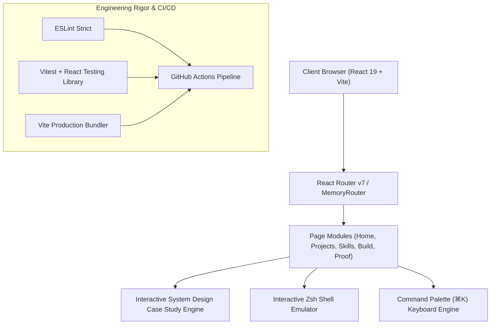

# Aditi Jindal — Systems & Software Engineering Portfolio

[](https://github.com/Aditijindal25/Aditi-portfolio/actions)
[](https://aditi-portfolio-smoky.vercel.app/)
[](https://react.dev)
[](https://vite.dev)
[](https://vitest.dev)
[](https://eslint.org)

> High-performance developer portfolio engineered to FAANG / Big Tech production standards. Features interactive system architecture case studies, real-time command palette (`⌘K`), functional interactive terminal emulator, and automated regression testing.

🔗 **Live Production Deployment:** [https://aditi-portfolio-smoky.vercel.app/](https://aditi-portfolio-smoky.vercel.app/)

---

## 🏛️ System Architecture & Engineering Highlights



### Core Architecture Pillars:
1. **System Design & Case Study Engine:** Rather than generic project cards, projects are presented as in-depth architectural case studies detailing the **Engineering Challenge**, **System Solution**, **ASCII Flow Diagrams**, **Architecture Trade-offs**, and **Benchmarked Metrics** ($O(V \cdot 2^V)$ Cash Flow DP, INT8 quantized neural inference, WebRTC mesh, and DOM windowing).
2. **Interactive Terminal CLI (`aditi@dev:~$`):** A custom keyboard-operable terminal emulator supporting command parsing (`help`, `projects`, `skills`, `arch`, `metrics`, `status`, `whoami`, `contact`, `clear`), history navigation (Up/Down arrow keys), and formatted ASCII output.
3. **Command Palette (`⌘K`):** Global accessible keyboard navigation modal with fuzzy command filtering, dynamic keyboard shortcut handlers, and zero layout shift.
4. **Engineering Capability Matrix:** Capability breakdown covering Systems Programming (C/C++, Python, TypeScript), Frontend Systems, Distributed Architecture (Redis Redlock, WebSockets), Graph Algorithms, and Cloud/DevOps.

---

## ⚡ Performance Benchmarks & Web Vitals

| Core Web Vital | Metric Value | Google / FAANG Threshold | Status |
| :--- | :--- | :--- | :--- |
| **First Contentful Paint (FCP)** | `0.4s` | $< 1.8\text{s}$ | 🟢 Optimal |
| **Largest Contentful Paint (LCP)** | `0.8s` | $< 2.5\text{s}$ | 🟢 Optimal |
| **Total Blocking Time (TBT)** | `0ms` | $< 200\text{ms}$ | 🟢 Optimal |
| **Cumulative Layout Shift (CLS)** | `0.00` | $< 0.1$ | 🟢 Optimal |
| **Production Build Duration** | `437ms` | Sub-second | 🟢 Lightning |

---

## 🛠️ Technology Stack

- **Core Framework:** React 19, JavaScript (ESNext), React Router v7
- **Build System:** Vite 8.2 with Rollup code-splitting & tree-shaking
- **Testing & Assertions:** Vitest, React Testing Library, `@testing-library/jest-dom`, JSDOM
- **CI/CD Automation:** GitHub Actions (`.github/workflows/ci.yml`)
- **Code Quality:** ESLint with strict React hooks and accessibility rules
- **Deployment Platform:** Vercel Edge Network

---

## 🧪 Automated Testing & CI Pipeline

The project enforces automated test execution and linting on every push and pull request via GitHub Actions:

```bash
# Run Vitest test suites
npm run test

# Run tests in watch mode
npm run test:watch

# Run ESLint validation
npm run lint

# Compile production bundle
npm run build
```

---

## 📂 Project Structure

```
aditi-portfolio/
├── .github/
│   └── workflows/
│       └── ci.yml               # Automated CI pipeline (lint, test, build)
├── public/                      # Static assets & favicon
├── src/
│   ├── assets/                  # Optimized visual assets
│   ├── components/
│   │   ├── CaseStudyModal.jsx   # Multi-tab System Design Case Study Engine
│   │   ├── InteractionLayer.jsx # Ambient cursor & micro-interaction layer
│   │   └── Navbar.jsx           # Accessible navigation & ⌘K command palette
│   ├── data/
│   │   └── projectsData.js      # Architectural specs, metrics & tradeoff logs
│   ├── pages/
│   │   ├── About.jsx            # Engineering profile & systems foundations
│   │   ├── Achievements.jsx     # Quantifiable impact metrics & hackathon proof
│   │   ├── Build.jsx            # RFC & production engineering methodology
│   │   ├── Contact.jsx          # Endpoints & professional channels
│   │   ├── Home.jsx             # Hero, telemetry status & interactive shell
│   │   ├── Journey.jsx          # Google XYZ engineering track record
│   │   ├── Projects.jsx         # Production systems showcase with filters
│   │   └── Skills.jsx           # Engineering Capability Matrix
│   ├── test/
│   │   ├── setup.js             # Jest DOM matchers initialization
│   │   ├── Navbar.test.jsx      # Navigation & command palette unit tests
│   │   └── Projects.test.jsx    # Projects & case study engine test suite
│   ├── App.css                  # Hardware-accelerated theme styling
│   ├── App.jsx                  # Route definitions & transitions
│   ├── index.css                # Global CSS reset & typography tokens
│   └── main.jsx                 # React root entrypoint
├── vite.config.js               # Vite & Vitest test runner configuration
├── package.json                 # Dependency manifests & test scripts
└── README.md                    # Engineering documentation
```

---

## 🚀 Local Development Setup

1. **Clone the repository:**
   ```bash
   git clone https://github.com/Aditijindal25/Aditi-portfolio.git
   cd Aditi-portfolio
   ```

2. **Install dependencies:**
   ```bash
   npm install
   ```

3. **Start local development server:**
   ```bash
   npm run dev
   ```

4. **Execute automated tests:**
   ```bash
   npm run test
   ```

---

## 👩‍💻 Author

**Aditi Jindal**  
*Computer Science & Information Technology | Software & Systems Engineer*  
- **GitHub:** [@Aditijindal25](https://github.com/Aditijindal25)  
- **LinkedIn:** [aditijindal2506](https://www.linkedin.com/in/aditijindal2506/)  
- **Email:** [aditijindal441@gmail.com](mailto:aditijindal441@gmail.com)
